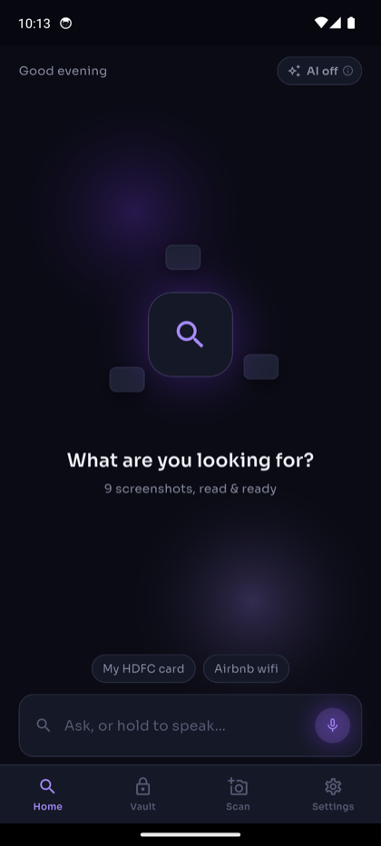
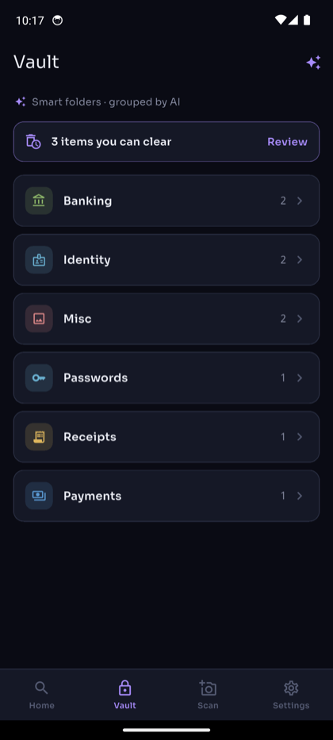
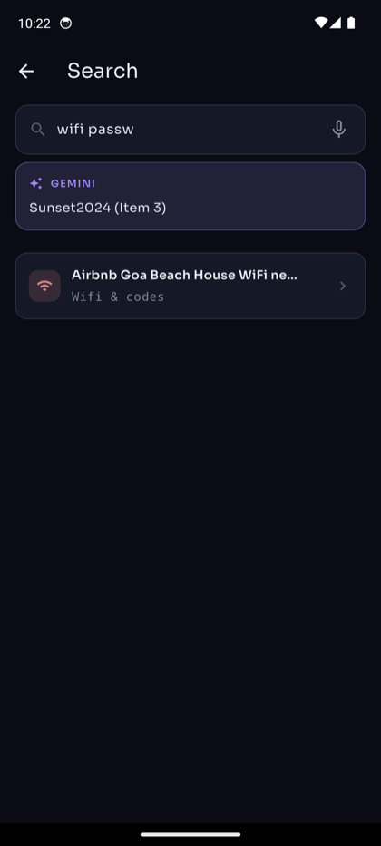
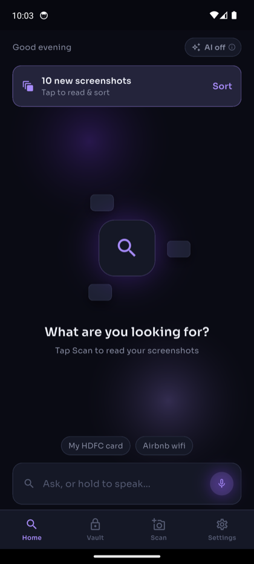
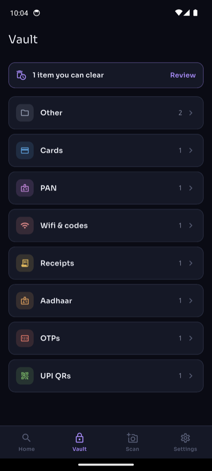
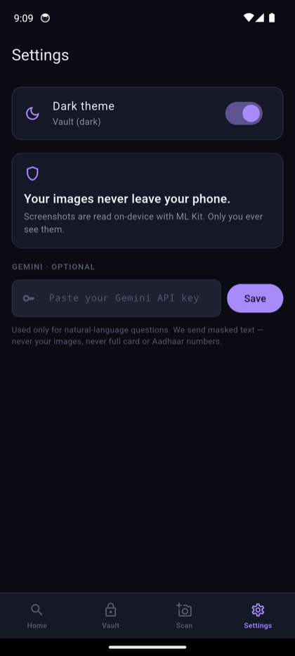
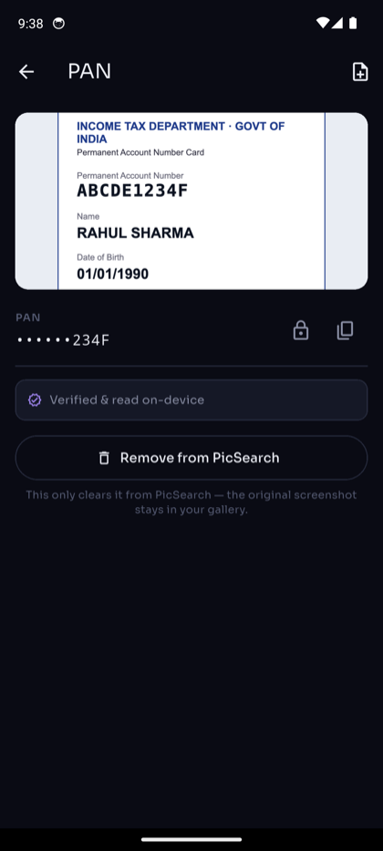
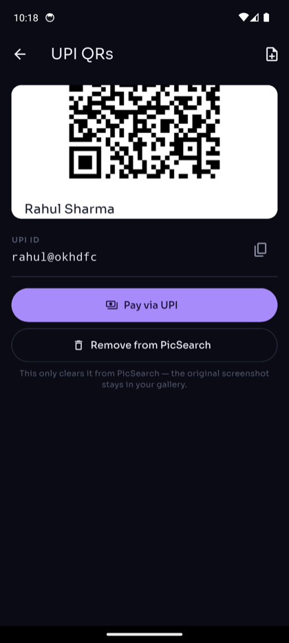
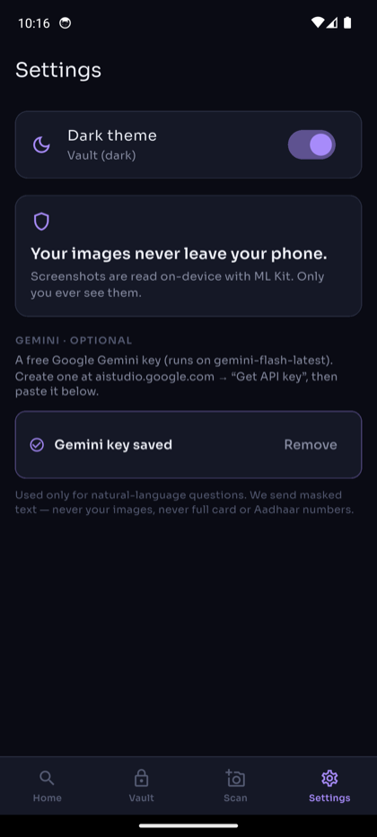

<h1 align="center">
  <br>
  PicSearch
</h1>

<p align="center"><b>Turn your screenshot pile into a private, searchable vault — entirely on-device.</b></p>

You screenshot a card, a wifi password, an Aadhaar, a receipt… then never find it
again. **PicSearch** reads every screenshot on your phone, works out *what it is*,
pulls out the useful bits, and makes them searchable — without a single image ever
leaving the device. Add a free Gemini key and it also sorts everything into smart
folders and answers questions in plain English.

> Engineering-round submission. Problem 3 — *turn messy documents into structured,
> queryable data* — interpreted as: **your screenshot gallery is the messy corpus.**
> Full reasoning in [`decisions.md`](decisions.md); the driving prompts in
> [`prompts.md`](prompts.md).

<p align="center">
  
  
  
</p>

---

## Contents

- [What it does](#what-it-does)
- [Features, in detail](#features-in-detail)
- [The hard part — *verify, don't guess*](#the-hard-part--verify-dont-guess)
- [Privacy model](#privacy-model)
- [How it works (architecture)](#how-it-works-architecture)
- [How to use](#how-to-use)
- [Setup, run & build](#setup-run--build)
- [Tests](#tests)
- [Project layout](#project-layout)

---

## What it does

- **Scan** your gallery → each screenshot is OCR'd **on-device** (Google ML Kit).
- **Extract & verify** the values — a card only files as a card if it passes the
  **Luhn** checksum; an Aadhaar only if it passes **Verhoeff**; PAN/IFSC by
  structure; UPI by decoding the `upi://` payload (or a bare `name@bank` VPA).
- **Vault** — auto-albums, sensitive values **masked** (`••••6467`), revealed only
  behind biometrics, one-tap **copy**, type-aware actions (e.g. *Pay via UPI*).
- **Search** — ask in your own words, by text or **voice**.
- **Private by default** — encrypted at rest (AES-256 + Android Keystore); images
  never leave the phone.
- **Optional AI (bring-your-own Gemini key)** — natural-language answers, plus
  **AI smart folders** and **AI cleanup** suggestions. Only *masked text* is ever
  sent; never images, never full card/Aadhaar numbers.

---

## Features, in detail

### 1 · On-device scan & auto-detect

PicSearch finds screenshots already in your gallery and reads them with ML Kit —
no upload, no cloud OCR. New screenshots are detected automatically; a tap on the
banner reads and sorts them, with a Gen-Z scan animation instead of a frozen
spinner.



- **Auto-detect** — “*N new screenshots · Sort*” appears when the gallery has
  images the vault hasn't read yet.
- **Dedup on ingest** — the same screenshot scanned twice is collapsed to one
  record (10 pushed → 9 stored in the demo).
- Works from the **Scan** tab (photo picker) or the auto-detect banner.

<br clear="right">

### 2 · Verify, don't guess — structured extraction

The core bet: don't *guess* a document's type from “does this text look like an
Aadhaar” — **verify it with the real algorithm**. That kills false positives on
messy OCR and is trivially unit-testable.

| Artifact | How it's verified |
|---|---|
| Debit/credit card | **Luhn** checksum (ISO/IEC 7812) |
| Aadhaar | **Verhoeff** checksum (the real 12th-digit algorithm) |
| PAN | structural regex `ABCDE1234F` |
| IFSC | 4-letter bank code + mandatory `0` + 6 alphanumerics |
| UPI | decode `upi://pay?pa=…`, or a bare `name@bank` VPA (emails excluded) |

### 3 · The Vault — auto-albums by type

Every read screenshot files itself into an India-aware taxonomy — Cards, Aadhaar,
PAN, Bank/IFSC, UPI QRs, Wifi & codes, Receipts, OTPs, … — each a coloured chip.
This is the default view when **no** Gemini key is set (fully offline).

<p>
  
  
</p>

> Both a dark (“Vault”) and light (“Daylight”) theme ship, toggleable in Settings.

### 4 · AI smart folders (replaces types when AI is on)

Add a Gemini key and the Vault regroups itself into **AI-named folders** —
*Payments, Identity, Banking, Passwords, Receipts…* — clustered by what the
screenshots actually are, not a fixed list. Grouping runs from **redacted text
only**, is cached, and re-runs automatically after each scan. Tap **✨** to
regroup on demand.


- Header reads **“✨ Smart folders · grouped by AI.”**
- One Gemini call labels every record (`aiGroup`), stored on the record.
- Falls back to the on-device type folders the moment the key is removed.

<br clear="right">

### 5 · AI cleanup suggestions

The *same* AI pass also flags **clearable junk** — one-time OTP codes, duplicates,
transient noise — with a reason, and never flags IDs, cards, passwords or
receipts. The Vault's “*N items you can clear*” banner becomes AI-judged when a key
is set (and falls back to a deterministic OTP-+-duplicate heuristic otherwise).

### 6 · Record detail — masked reveal, copy & type actions

<p>
  
  
</p>

- **Real image preview** — the actual screenshot, **blurred + biometric-gated**
  for sensitive records (tap to reveal).
- **Masked fields** — `••••••234F` until you reveal (biometric), with one-tap copy.
- **“Verified & read on-device”** badge on validated records.
- **Type-aware actions** — a UPI record offers **Pay via UPI**; you can also add
  fields by hand (CVV, cardholder name…) and mark them private.
- **Honest deletes** — *Remove from PicSearch* clears the record only; your gallery
  original is never touched.

### 7 · Search — text, voice & Ask Gemini


- **Natural-language keyword search**, on-device — stop-words stripped, OR-matched
  and ranked (“*wifi password*” finds the Airbnb wifi note).
- **Voice search** — hold to speak (device speech-to-text).
- **Ask Gemini** — with a key, get a grounded plain-English answer from your vault.
  In the demo, *“wifi password”* → **“Sunset2024 (Item 3)”**, pulled from the
  redacted context and cited to its source item.

<br clear="right">

### 8 · Bring-your-own Gemini key — verified on save



- Settings names exactly **which** key to use: a free **Google Gemini** key
  (runs on `gemini-flash-latest`), from `aistudio.google.com`.
- **The key is verified with a live request on Save** — a bad key fails at entry,
  not at your first question. Stored in the Android Keystore.
- The home **AI on / off** chip surfaces the state with a one-tap explainer.

<br clear="right">

### 9 · Privacy & encryption

- **Images never leave the phone** — OCR + extraction are 100% on-device.
- **Encrypted at rest** — records are AES-256 encrypted with a key in the Android
  Keystore; only ciphertext hits app-private storage.
- **Gemini is opt-in and text-only** — grouping, cleanup and answers send only
  *redacted* text (digit runs of 6+ → last-4), never images, never full
  card/Aadhaar numbers.

---

## The hard part — *verify, don't guess*

A running eval proves the payoff on a hand-labelled set that includes
**adversarial negatives** — a tampered card, a bad-checksum Aadhaar, a malformed
PAN, a phone number, a non-Luhn 16-digit string — all correctly **rejected**:

```
$ dart run tool/eval.dart
┌─ PicSearch · extraction & classification eval ───────────
│ Samples                 : 18
│ Classification accuracy : 100.0%  (18/18)
│ Extraction precision    : 100.0%  (TP=10, FP=0)
│ Extraction recall       : 100.0%  (FN=0)
└──────────────────────────────────────────────────────────
```

Zero false positives, by construction. (A curated logic-correctness set — real-world
OCR accuracy is lower.) Live testing on a real device with real screenshots also
surfaced — and fixed — a corrupted Verhoeff table that had been silently rejecting
valid Aadhaar numbers (see [`decisions.md`](decisions.md) §16).

---

## Privacy model

| | With **no** key | With a **Gemini** key |
|---|---|---|
| OCR & extraction | on-device | on-device |
| Grouping & cleanup | deterministic, on-device | Gemini, **masked text only** |
| Search | on-device keyword | + optional grounded answers |
| Images | never sent | **never sent** |
| Full card/Aadhaar numbers | never stored plaintext-visible | **never sent** |

---

## How it works (architecture)

```
 screenshot ─▶ on-device OCR ─▶ detect + VERIFY ─▶ classify ─▶ encrypted vault ─▶ search
   (pixels)     (ML Kit)        Luhn / Verhoeff     category    AES-256 (Keystore)  keyword + voice
                                PAN / IFSC / UPI    + fields         │
                                                                     ▼  (optional, masked text only)
                                                          Gemini ─▶ smart folders + cleanup + answers
```

Layered so the hard logic is provable without a device:

| Layer | Files | Depends on |
|---|---|---|
| **Pure core** (messy→structured) | `lib/src/validators.dart`, `analyzer.dart`, `classifier.dart`, `masking.dart`, `search.dart`, `vault_codec.dart`, `gemini.dart` (prompt/redaction/parse) | nothing — plain Dart, unit-tested |
| **Device services** | `ocr_mlkit.dart`, `vault_store.dart` (Keystore + file), `gallery_scanner.dart`, `biometric.dart` | platform plugins |
| **UI** | `lib/ui/*`, `lib/theme.dart` | Flutter |

The whole “messy → structured” transform — including the Gemini prompt building,
redaction, and response parsing — is pure and synchronous, so it runs under
`dart test` in milliseconds with no OCR, UI, or network.

---

## How to use

1. **Open PicSearch.** Grant photo access.
2. Tap the **“N new screenshots · Sort”** banner (or **Scan** → pick images). They
   OCR and sort into the **Vault**.
3. Open any record to **reveal** (biometric) and **copy** a value, or act on it
   (**Pay via UPI**, add a private field, remove).
4. **Search** from Home — type or hold the mic — e.g. *“my hdfc card”*, *“airbnb wifi”*.
5. **(Optional) Turn on AI:** Settings → paste a free Gemini key
   (`aistudio.google.com` → *Get API key*). The Vault regroups into **smart
   folders**, cleanup goes AI-judged, and **Ask Gemini** answers questions.

---

## Setup, run & build

**Prerequisites:** Flutter (stable) + Android SDK (`flutter doctor` shows the
Android toolchain ✓).

```bash
flutter pub get
flutter test                  # 59 tests
dart run tool/eval.dart       # prints the accuracy report

flutter run                   # run on a connected device / emulator
flutter build apk --release   # → build/app/outputs/flutter-apk/app-release.apk
```

Install the APK on any Android phone (`adb install app-release.apk`, or copy it
across).

---

## Tests

- **`flutter test` — 59 tests:** checksum validators (Luhn / Verhoeff /
  PAN / IFSC / UPI + the VPA rule + a canonical-Verhoeff guard), masking,
  classification, the scan pipeline, AES round-trip, the NL search ranker, Gemini
  redaction / key-verification / grouping-parse, a `MaskedField` widget test, and
  the eval gate.
- **`dart run tool/eval.dart`** — the accuracy report above.

---

## Project layout

```
lib/
  src/         pure core: validators, analyzer, classifier, masking, search,
               models, vault_codec, gemini, ocr_service (+ ml kit impl), scan_pipeline
  state/       AppState (records, scan, AI regroup, persistence) + AppScope
  ui/          splash, home, vault (type + AI folders), record detail,
               search, settings, cleanup, theme
eval/          labelled samples + scorer for the accuracy report
tool/eval.dart runnable eval report
test/          unit + widget + eval tests
docs/          screenshots used in this README
decisions.md   every real call, with alternatives and trade-offs (16 entries)
prompts.md     the human prompts that drove the build
```

See **[`FEATURES.md`](FEATURES.md)** for the full feature list and end goal.

---

*Dart package `picsearch`, Android application id `com.mukul.picsearch`. The project
was briefly named SnapVault pre-launch (see `decisions.md` §10).*
